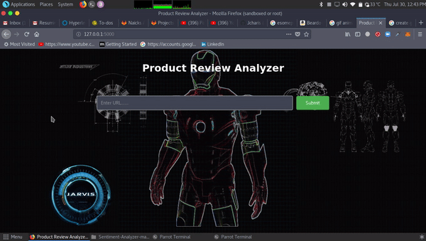
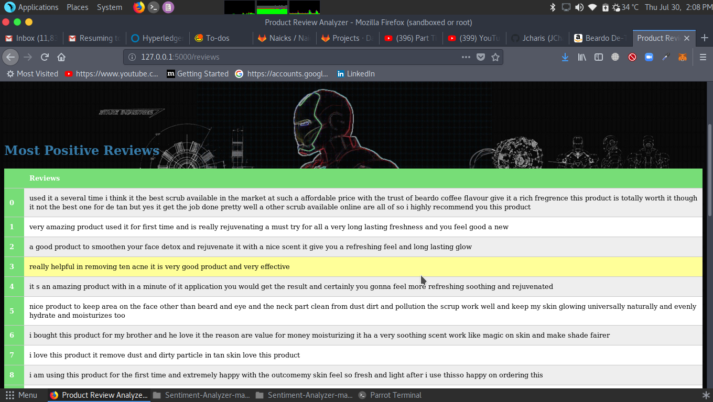
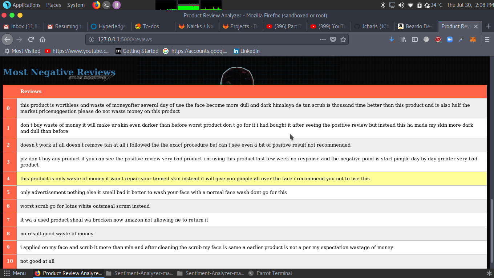

# Product_Analayzer

Simple Product analayzer web app that use ML to predict the posivite and negative reviews

How to Run the code -
  1. vist amazon.in and select the product.
  2. copy the url
  3. run server.py from the colned folder. ( python server.py )
  4. go the localhost and paste the url on url bar the click submit
  5. wait for some time beacuse it process the data 
  6. you get the table of positive and negative reviews on that product.
  
 ScreenShot-
  
 
 
 
 
 
 
 
 
 
 
 
 
 
 
 
 
 
 

 
 
 
 
 
 
 
 
 
 
 
 
 
 
 
